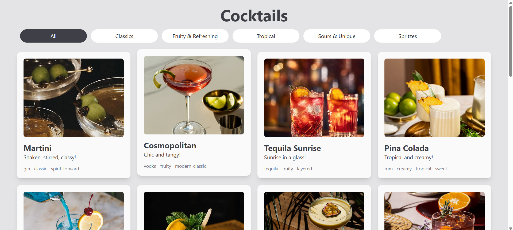
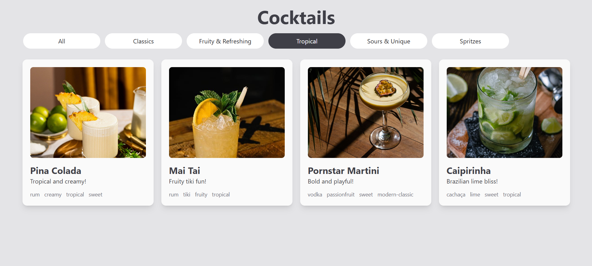

# Cocktails 🍸
This is another simple frontend-only project I built to revise React.js after returning from summer vacation (hence the cocktail theme).
The app displays various cocktails, which can be filtered by categories and tags, and clicking on a drink reveals more details.

### What I used:
